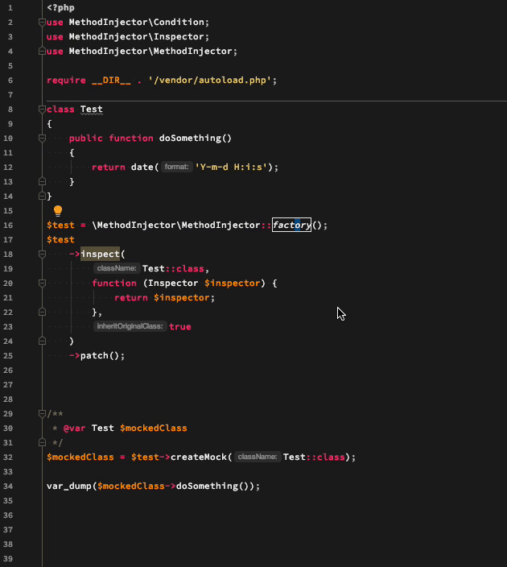

# What is MethodInjector?
`MethodInjector` は対象のクラスにあるメソッドやフィールド、定数のテストダブルの生成を強力にサポートするためのオープンソースソフトウェアのプロジェクトです。
例えば `MethodInjector` は下記のようなことを行えます。

- メソッドの内の関数をモック用の関数や無名関数に置き換えて実行させる
- 指定したフィールドのデフォルト値を書き換える
- 定数の値を書き換えてテストを行う
- 特定のメソッドそのものの返り値をモック化する
- メソッド実行開始時と終了時に処理を挿入できる

`MethodInjector` はオリジナルのクラスファイルを AST 解析し、クラスを再構築します。
そのため、オリジナルのクラスが継承不可 (`final` が定義されている) などでも容易にテストダブルを作成することができます。
しかし、オリジナルのクラスを継承することも可能で、宣言の期待をしているクラスを継承してでのテストダブルの作成を行うこともできます。

# ドキュメント
- 日本語
- [English](./readme.md)

# DEMO


# クイックスタート
下記よりインストール可能です。

```
composer require --dev m3m0r7/method-injector
```


# 例
## 一般的な使用方法
`MethodInjector` でテストダブルを作成するには下記のようにします。

```php
<?php
require __DIR__ . '/vendor/autoload.php';

use MethodInjector\Condition;
use MethodInjector\Inspector;
use MethodInjector\MethodInjector;

$test = \MethodInjector\MethodInjector::factory();
$test
    ->inspect(
        Test::class,
        function (Inspector $inspector) {
            return $inspector
                ->methodGroup(
                    '*',
                    function (Condition $condition) {
                        return $condition
                            ->replaceFunction(
                                'date',
                                function (...$args) {
                                    return '2012-01-01';
                                }
                            );
                    }
                );
        }
    )
    ->patch();

$mock = $test->createMock(Test::class);
```

`factory` メソッドを呼ぶと `MethodInjector` のインスタンスが返されます。 `inspect` は第一引数にテストダブルを作成したいクラス名、
第二引数に検証及びテストダブルを作成する条件を指定することが可能で、第三引数はオリジナルのクラスを継承するかを指定できます。
また、`inspect` メソッドはいくつかコールすることができ、複数のクラスのテストダブルをまとめて作成することも可能です。

```php
<?php
require __DIR__ . '/vendor/autoload.php';

use MethodInjector\Condition;
use MethodInjector\Inspector;
use MethodInjector\MethodInjector;

$test = \MethodInjector\MethodInjector::factory();
$inspector = function (Inspector $inspector) {
    return $inspector
        ->methodGroup(
            '*',
            function (Condition $condition) {
                return $condition
                ->replaceFunction(
                    'date',
                    function (...$args) {
                        return '2012-01-01';
                    }
                );
        }
    );
};
$test
    ->inspect(
        Foo::class,
        $inspector
    )
    ->inspect(
        Bar::class,
        $inspector
    )
    ->patch();

$fooMock = $test->createMock(Foo::class);
$barMock = $test->createMock(Bar::class);
```

テストダブルは `MethodInjector` 専用の名前空間に生成するため、基本的にグローバル名前空間を汚すことはありません。

## リプレイス対象のメソッドを制限する
`MethodInjector` は `Inspector` クラスの `methodGroup` でメソッド名を指定することにより、リプレイス対象のメソッドを指定し、制限することも可能です。
メソッド名は PHP の仕様に則り、大文字小文字を区別しません。

```php
<?php
require __DIR__ . '/vendor/autoload.php';

use MethodInjector\Condition;
use MethodInjector\Inspector;
use MethodInjector\MethodInjector;

$test = \MethodInjector\MethodInjector::factory();
$test
    ->inspect(
        Test::class,
        function (Inspector $inspector) {
            return $inspector
                ->methodGroup(
                    // リプレイス対象のメソッドを test  のみにする
                    'test',
                    function (Condition $condition) {
                        return $condition
                            ->replaceFunction(
                                'date',
                                function (...$args) {
                                    return '2012-01-01';
                                }
                            );
                }
            );
        }
    )
    ->patch();

$mock = $test->createMock(Test::class);
```


## クラス内のフィールドを置き換える
クラス内のフィールドのデフォルト値を書き換えたいこともあるでしょう。 `replaceField` を使うことにより、フィールドのデフォルト値を変更することも可能です。
もちろん、対象のフィールドが `private`, `protected` であっても変更可能です。

```php
<?php
require __DIR__ . '/vendor/autoload.php';

use MethodInjector\Condition;
use MethodInjector\Inspector;
use MethodInjector\MethodInjector;

$test = \MethodInjector\MethodInjector::factory();
$test
    ->inspect(
        Test::class,
        function (Inspector $inspector) {
            return $inspector
                ->replaceField('testField', 'changed default value');
        }
    )
    ->patch();

$mock = $test->createMock(Test::class);

echo $mock->testField;
```

## クラス内の定数を置き換える
フィールドを書き換えるのと同じ要領で定数値も `replaceConstant` を使用して書き換えることが可能です。もちろん、これも `private`, `protected` であっても可能です。

```php
<?php
require __DIR__ . '/vendor/autoload.php';

use MethodInjector\Condition;
use MethodInjector\Inspector;
use MethodInjector\MethodInjector;

$test = \MethodInjector\MethodInjector::factory();
$test
    ->inspect(
        Test::class,
        function (Inspector $inspector) {
            return $inspector
                ->replaceConstant('TEST', 'changed default value');
        }
    )
    ->patch();

$mock = $test->createMock(Test::class);

echo $mock::TEST;
```

## メソッドの実行開始時に出力をする
メソッドの実行開始時に何かしらの処理を挟みたい場合もあると思います。 `MethodInjector` では `Condition` クラスの `before` を指定することで、
実行開始時に何かしらの処理を挟むことが出来ます。例えば、メソッド単体の実行時間を計測したい場合などに有用です。

```php
<?php
require __DIR__ . '/vendor/autoload.php';

use MethodInjector\Condition;
use MethodInjector\Inspector;
use MethodInjector\MethodInjector;

$test = \MethodInjector\MethodInjector::factory();
$test
    ->inspect(
        Test::class,
        function (Inspector $inspector) {
            return $inspector
                ->methodGroup(
                    '*',
                    function (Condition $condition) {
                        return $condition
                            ->before(function () {
                                echo "Hello HEAD!\n";
                            });
                }
            );
        }
    )
    ->patch();

$mock = $test->createMock(Test::class);
```

## メソッドの実行終了時に出力をする
メソッドの実行終了時も開始時と同様に指定することができます。終了時の場合、 `after` を呼び出します。

```php
<?php
require __DIR__ . '/vendor/autoload.php';

use MethodInjector\Condition;
use MethodInjector\Inspector;
use MethodInjector\MethodInjector;

$test = \MethodInjector\MethodInjector::factory();
$test
    ->inspect(
        Test::class,
        function (Inspector $inspector) {
            return $inspector
                ->methodGroup(
                    '*',
                    function (Condition $condition) {
                        return $condition
                            ->after(function () {
                                echo "Finish to run.\n";
                            });
                }
            );
        }
    )
    ->patch();

$mock = $test->createMock(Test::class);
```

## メソッド内のクラスを置き換える
`MethodInjector` はメソッド内でインスタンス化されているクラスを `replaceInstance` を用いて別のクラスに置き換えることも可能です。
これによりまだ開発途中であったり、別のクラスに差し替えたいというようなユースケースにも対応可能です。
他にも `static` や `self` などで読んでいる場合でも差し替えることが可能です。

```php
<?php
require __DIR__ . '/vendor/autoload.php';

use MethodInjector\Condition;
use MethodInjector\Inspector;
use MethodInjector\MethodInjector;

$test = \MethodInjector\MethodInjector::factory();
$test
    ->inspect(
        Test::class,
        function (Inspector $inspector) {
            return $inspector
                ->methodGroup(
                    '*',
                    function (Condition $condition) {
                        return $condition
                            ->replaceInstance(
                                Foo::class,
                                Bar::class
                            );
                }
            );
        }
    )
    ->patch();

$mock = $test->createMock(Test::class);
```

もちろんクラスの静的なメソッドを読んでいるような箇所でも `replaceStaticCall` を利用することにより下記のように置き換えられます。

```php
<?php
require __DIR__ . '/vendor/autoload.php';

use MethodInjector\Condition;
use MethodInjector\Inspector;
use MethodInjector\MethodInjector;

$test = \MethodInjector\MethodInjector::factory();
$test
    ->inspect(
        Test::class,
        function (Inspector $inspector) {
            return $inspector
                ->methodGroup(
                    '*',
                    function (Condition $condition) {
                        return $condition
                            ->replaceStaticCall(
                                Foo::class,
                                Bar::class
                            );
                }
            );
        }
    )
    ->patch();

$mock = $test->createMock(Test::class);
```

## メソッドをモック化する
メソッドそのものが開発途中であったり、一定の値を返したテストを行いたい、テストの関心事の範囲外である場合などでテストダブルを作成したいこともあるでしょう。
`MethodInjector` では `replaceMethod` を使用してメソッドそのもののテストダブルを作成することも可能です。

```php
<?php
require __DIR__ . '/vendor/autoload.php';

use MethodInjector\Condition;
use MethodInjector\Inspector;
use MethodInjector\MethodInjector;

$test = \MethodInjector\MethodInjector::factory();
$test
    ->inspect(
        Test::class,
        function (Inspector $inspector) {
            return $inspector
                ->replaceMethod(
                    'testMethod',
                    function () {
                        return 'Fixed value.';
                    }
                );
        }
    )
    ->patch();

$mock = $test->createMock(Test::class);
```

## リプレイサーを追加する
`MethodInjector` は予めいくつかのリプレイサーを提供していますが、状況に応じてリプレイサーを追加したい場合もあるかと思います。
その場合はリプレイサーを追加することも可能です。`MethodInjector` のリプレイサーはデフォルトとして設定されていますが、オリジナルのリプレイサーが追加された場合
`MethodInjector` がデフォルトで提供するのリプレイサーは使用しないので、引数で指定し直すなど注意してください。

```php
<?php
require __DIR__ . '/vendor/autoload.php';

use MethodInjector\Condition;
use MethodInjector\Inspector;
use MethodInjector\MethodInjector;

$test = \MethodInjector\MethodInjector::factory([
    'replacer' => [
        [Inspector::FUNCTION, MyFunctionReplacer::class],
        [Inspector::CLASS_CONSTANT, MyConstantReplacer::class],
    ],
]);
$test
    ->inspect(
        Test::class,
        function (Inspector $inspector) {
            return $inspector
                ->replaceMethod(
                    'testMethod',
                    function () {
                        return 'Fixed value.';
                    }
                );
        }
    )
    ->patch();

$mock = $test->createMock(Test::class);
```

`addReplacer` を使用した場合は `MethodInjector` が提供しているリプレイサーをそのまま使用することができます。
リプレイサーはリデュースのように動作し、指定された順から AST 解析されたノードに対して適用していきます。

```php
<?php
require __DIR__ . '/vendor/autoload.php';

use MethodInjector\Condition;
use MethodInjector\Inspector;
use MethodInjector\MethodInjector;

$test = \MethodInjector\MethodInjector::factory();
$test
    ->inspect(
        Test::class,
        function (Inspector $inspector) {
            return $inspector
                ->addReplacer(Inspector::FUNCTION, MyFunctionReplacer::class)
                ->addReplacer(Inspector::CLASS_CONSTANT, MyConstantReplacer::class);
        }
    )
    ->patch();
```

## インスペクターを変更する
`MethodInjector` のインスペクターは必要最低限の機能しか提供していないため、歴史のあるプロジェクトで使用できないなどの障害があるかもしれません。
その場合、テストをするためにインスペクターそのものを差し替えたいかもしれません。もちろん、オリジナルのインスペクターを実装することも可能です。その場合 `MethodInjector` がデフォルトで提供している `Inspector` を継承する必要があります。

```php
<?php
require __DIR__ . '/vendor/autoload.php';

use MethodInjector\Condition;
use MethodInjector\Inspector;
use MethodInjector\MethodInjector;

$test = \MethodInjector\MethodInjector::factory([
    'inspectorClass' => MyInspector::class,
]);
$test
    ->inspect(
        Test::class,
        function (Inspector $inspector) {
            return $inspector
                ->addReplacer(Inspector::FUNCTION, MyFunctionReplacer::class)
                ->addReplacer(Inspector::CLASS_CONSTANT, MyConstantReplacer::class);
        }
    )
    ->patch();
```

## 親クラスやトレイトに定義されているフィールドやクラスも同時にモック化する
`MethodInjector` は親クラスに定義されているメソッドやフィールド、そして同様にトレイトも静的解析を行い AST に分解し、それぞれモック化を行う機能があります。
この機能を使うことにより、テストダブルを作成する際に親クラス及びトレイトのメソッドをどうモック化すればよいかを考える必要がなくなり、目の前のテストを書くことに集中することができます。
また `MethodInjector` は再帰的にクラスを参照するため、親クラスだけに留まらず、親クラスの親クラスであったり、トレイトであればトレイト内で定義されているトレイトもモック化の対象にすることも可能です。

```php
<?php
require __DIR__ . '/vendor/autoload.php';

use MethodInjector\Condition;
use MethodInjector\Inspector;
use MethodInjector\MethodInjector;

$test = \MethodInjector\MethodInjector::factory();
$test
    ->inspect(
        Test::class,
        function (Inspector $inspector) {
            return $inspector
                ->enableParentMock(true)
                ->enableTraitsMock(true);
        }
    )
    ->patch();
```

# ビルダー
`MethodInjector` を使っているとモックを作るためのコードの量が長いと感じることがあるかと思います。そのため、 `MethodInjector` には `MethodInjector` の
オブジェクトを簡易的に生成できるように `ConditionBuilder` と呼ばれるビルダークラスを用意しています。
`ConditionBuilder` はデフォルトで親クラス及びトレイトすべてのメソッド及びプロパティをモック化します。


```php
<?php
use MethodInjector\Builder\ConditionBuilder;

$builder = ConditionBuilder::factory(Test::class)
    ->replaceFunction(
        'date',
        function (...$args) {
            return '9999-99-99';
        }
    )
    ->make()
    ->patch();
```

上記のように記述することが可能です。また、上記は下記と等価です。

```php
<?php
$test = \MethodInjector\MethodInjector::factory();
$test
    ->inspect(
        Test::class,
        function (Inspector $inspector) {
            return $inspector
                ->methodGroup(
                    '*',
                    function (Condition $condition) {
                        return $condition
                            ->replaceFunction(
                                'date',
                                function (...$args) {
                                    return '9999-99-99';
                                }
                            );
                    }
                )
                ->enableParentMock(true)
                ->enableTraitsMock(true);
        }
    )
    ->patch();
```

`ConditionBuilder` で適用されるメソッドの範囲はデフォルトにおいては `*`, つまりすべてのメソッドが対象です。
しかし、一部のメソッドのみのモック化をしたい場合もあると思います。その場合は `group` を使うことによってミュータブルに変更対象のメソッドを指定することが可能です。


```php
<?php
use MethodInjector\Builder\ConditionBuilder;

$builder = ConditionBuilder::factory(Test::class)
    ->group('doSomething')
    ->replaceFunction(
        'date',
        function (...$args) {
            return '9999-99-99';
        }
    )
    ->make()
    ->patch();
```

この場合、 `doSomething` 内の `date` 関数をすべてモック化するということになります。


```php
<?php
use MethodInjector\Builder\ConditionBuilder;

$builder = ConditionBuilder::factory(Test::class)
    ->group('doSomething1')
    ->replaceFunction(
        'date',
        function (...$args) {
            return '9999-99-99';
        }
    )
    ->group('doSomething2')
    ->replaceFunction(
        'date',
        function (...$args) {
            return '0000-00-00';
        }
    )
    ->make()
    ->patch();
```

上記の場合は `doSomething1` で実行されている date は `9999-99-99` を返し `doSomething2` で実行されている date は `0000-00-00` を返すようになります。

## ライセンス
MIT
